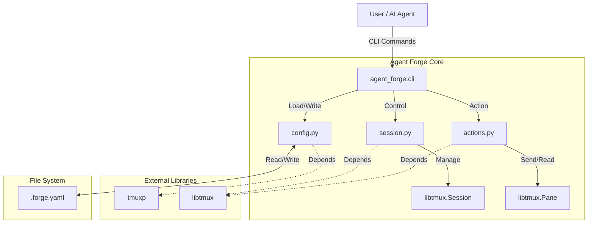

# Agent Forge Architecture

## System Overview

Agent Forge is built upon `tmuxp` and `libtmux`, acting as a higher-level orchestration layer for AI agents.

## Module Responsibilities

### `agent_forge.cli`
The entry point. Handles argument parsing, user interaction, and dispatching commands to the core logic. It does *not* contain complex business logic.

### `agent_forge.config`
Responsible for the static definition of the environment.
- Loading/Saving `.forge.yaml`.
- Validating configuration structure.
- Providing default templates.

### `agent_forge.session` (Runtime Controller)
Responsible for the lifecycle of the tmux session.
- Finding active sessions.
- Resolving vague target names (e.g., "architect") to concrete `libtmux.Pane` objects.
- interfacing with `tmuxp` to load workspaces.

### `agent_forge.actions` (Communication Layer)
Defines the primitives for Agent-to-Agent communication.
- `send_command`: Wraps `pane.send_keys`.
- `read_output`: Wraps `pane.capture_pane`.

## Data Flow: "The Forge Loop"

1.  **Init**: User runs `forge init`. `config.py` generates `.forge.yaml`.
2.  **Start**: User runs `forge start`. `session.py` uses `tmuxp` to spawn the tmux server and windows defined in YAML.
3.  **Interact**:
    - User runs `forge send architect "plan.md"`.
    - `cli` parses args.
    - `session` finds the pane named "architect".
    - `actions` executes `pane.send_keys("plan.md")`.
4.  **Observe**:
    - User runs `forge read architect`.
    - `actions` captures pane content and returns it to stdout.
